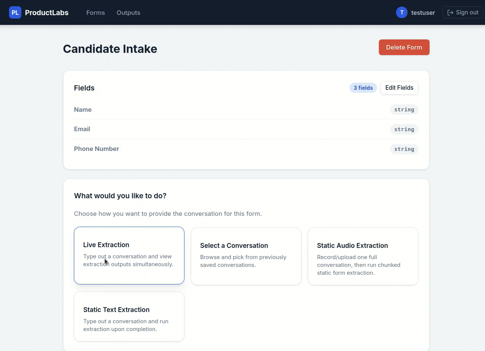

# ProductLabs AI Form Filler

# ProductLabs AI Form Filler

[](https://fastapi.tiangolo.com/)
[](https://www.mongodb.com/)
[](https://www.docker.com/)
[](https://github.com/QwenLM/Qwen2.5)
[](LICENSE)

An enterprise-grade, event-driven intelligent orchestration platform that transforms unstructured asynchronous dialogues (text and audio) into structured, validated domain schemas using pluggable LLM and Speech-to-Text inference backends. Built with a decoupled Clean Architecture, the platform processes conversational data incrementally as an evolving finite-state machine rather than using fragile one-shot extraction.

<div class="image-gallery-container" style="width: 100%; text-align: center; font-size: 0;">
    <div class="image-wrapper" style="display: inline-block; width: 48%; margin-right: 2%; vertical-align: top; font-size: 14px;">
        
        <p style="margin-top: 8px; color: #4a5568; font-style: italic;">Figure 1: Live chat extraction</p>
    </div>
    <div class="image-wrapper" style="display: inline-block; width: 48%; vertical-align: top; font-size: 14px;">
        
        <p style="margin-top: 8px; color: #4a5568; font-style: italic;">Figure 2: Available options</p>
    </div>
</div>

---

## System Features Matrix

| Feature Domain | Capabilities & Technical Implementation |
| :--- | :--- |
| **Dynamic Schema Engine** | • **Custom Form Builder:** Create, update, and version highly specialized forms tailored to unique domain workflows.<br>• **Polymorphic Field Architecture:** Define custom extraction targets using structural natural-language instructions or explicit datatype rules. |
| **Multi-Channel Ingestion Flow** | • **Static Text Parsing:** Ingest and normalize complete speaker-labeled scripts (`Speaker: Text`) into transactional timelines.<br>• **Live Incremental Entry:** Stream conversational turns in real-time with continuous UI preview updates as the dialogue unfolds.<br>• **Asynchronous Audio Processing:** Upload raw voice recordings directly into the automated processing pipeline. |
| **Speaker Diarization Pipelines** | • **Acoustic Speaker Segregation:** Isolate and label independent voice tracks from single-channel audio inputs.<br>• **Temporal Voice Tracking:** Map exactly who spoke when to generate clean, speaker-labeled conversational transcripts automatically. |
| **Intelligent Contextual Insights** | • **Turn-by-Turn Summarization:** Generate an immediate, high-density analytical summary of the interaction automatically after every extraction execution.<br>• **Out-of-Schema Field Suggestions:** Leverage LLM reasoning to identify critical, off-record information and surface dynamic suggestions for new form fields based on conversational context. |
| **Enterprise Identity Governance** | • **Granular Role-Based Access Control (RBAC):** Restrict system access and secure workflows with distinct data-boundary privileges for regular **Users** and platform **Administrators**. |


---

##  Quick Start (Dockerized Microservices)

### Prerequisites

* Docker & Docker Compose (v2.0+)
* Minimum 8GB RAM allocated to your Docker host container if utilizing local inference engines.

### Deployment Steps

1. Navigate to the deployment context root:
    ```bash
    cd product-based-form-filler
    ```

2. Populate the local application context runtime variables (`.env`):

    ```env
    MONGO_URI=mongodb://mongodb:27017/chat_db
    DB_NAME=chat_db
    MODEL_SERVICE_URL=http://model-service:8001
    ```


3. Initialize the distributed composition stack:
    ```bash
    docker compose -f docker/docker-compose.yml up --build -d
    ```

4. Access the presentation web dashboard at `http://localhost:8000`

---

##  Local Developer Workflow (Lightweight)

For rapid UI/UX validation or end-to-end flow auditing without local GPU/ML dependencies, instantiate with a mock orchestration driver:

```bash
# Setup isolation environment
python -m venv .venv
source .venv/bin/activate
pip install -r requirements.app.txt

# Bootstrap persistent state database in background
docker compose -f docker/docker-compose.yml up -d mongodb

# Configure runtime mock variables
export MONGO_URI="mongodb://localhost:27017/chat_db"
export DB_NAME="chat_db"
export MOCK_MODELS="true"

# Boot the hypercorn/uvicorn worker
uvicorn app.interface.api:app --host 0.0.0.0 --port 8000 --reload

```
---

## Pluggable Inference Matrix Resolution

### Sample Environment Injections

#### Production Scale-Out (Distributed Serverless via Modal)

```env
USE_MODAL_INFERENCE=true
MODAL_INFERENCE_USE_SDK=true
MODAL_APP_NAME=monomodel-qwen3-4b-infer
MODAL_EXTRACT_FUNCTION=modal_live_extract
MODAL_SUMMARIZER_FUNCTION=modal_summarize

```

#### Localized Self-Hosted Matrix (Ollama Infrastructure)

```env
USE_OLLAMA=true
OLLAMA_BASE_URL=http://localhost:11434
OLLAMA_EXTRACT_MODEL=qwen2.5:1.5b
OLLAMA_SUMMARIZER_MODEL=qwen2.5:1.5b

```

---

##  Comprehensive Verification Suite

The repository implements a rigid verification hierarchy composed of unit tests, transactional integration flows, and browser-driven End-to-End headless UI testing using Playwright.

### Core Testing Setup

```bash
pip install -r requirements.txt
docker compose -f docker/docker-compose.yml up -d mongodb
```

### Programmatic Integration & Unit Execution

```bash
export MOCK_MODELS="true"
# Run Full Integration Flows
python -m pytest tests/test_interface_flows.py
# Run Domain Domain & Text Rendering Unit Specifications
python -m pytest tests/test_unit_domain_speakers.py
python -m pytest tests/test_unit_interface_helpers.py

```

### Headless Web UI Testing Validation

```bash
# Install automated browser binaries
python -m playwright install chromium

# Fire testing scripts
bash scripts/run_e2e_headless.sh

```

---

##  Structural Layout

```text
.
├── app/                  # Application Monolithic Root Context
│   ├── domain/           # Framework-Agnostic Core Business Objects & Interfaces
│   ├── application/      # Orchestration Use Cases and Pipeline Logic
│   ├── infrastructure/   # Persistent DB Proxies, Configurations, and ML Adapters
│   └── interface/        # High-Concurrency FastAPI Router, WebSockets & Assets
├── data/                 # Deterministic Datasets, Synthetic Generation & Execution Logs
├── dataset_generation/   # Multi-turn Synthetic LLM Script Pipelines & Fine-tuning Scripts
├── docker/               # Configuration Matrices & Multi-Stage Deployment Buildpacks
├── scripts/              # Automated Infrastructure & Verification Orchestration Scripts
└── tests/                # Hierarchical Test Suites (Unit, Integration, Playwright E2E)

```

---

##  Documentation Index

* **Deep Architectural Assessment:** See [TECHNICAL_REPORT.md](docs/TECHNICAL_REPORT.md) for complete file-by-file structural breakdowns.
* **License Terms:** MIT License protected. See [LICENSE](LICENSE) for details.

